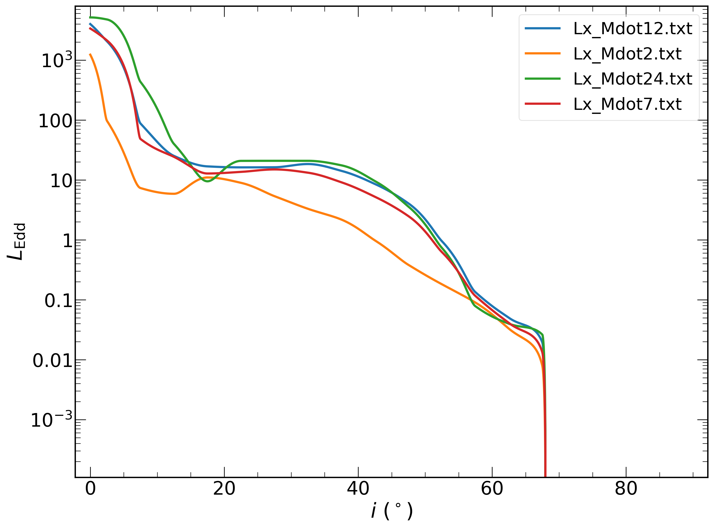

# QPEs
Fitting the lightcurves of quasi-periodic eruptions (QPEs) with a precession model and the output of GRMHD simulations 
The model is based on the kinematic model proposed to explain the periodic variations observed in the infamous high-mass X-ray binary SS433 ([Abel & Margon 1977](https://ui.adsabs.harvard.edu/abs/1979Natur.279..701A)):

We couple that equation with the outputs from GRMHD simulations, which derived the Eddington luminosity (in the 0.3 $-$ 10 keV band) as a function of observer's inclination ($i$):

Only four values of $\dot{m}$ were calculated, as shown.
