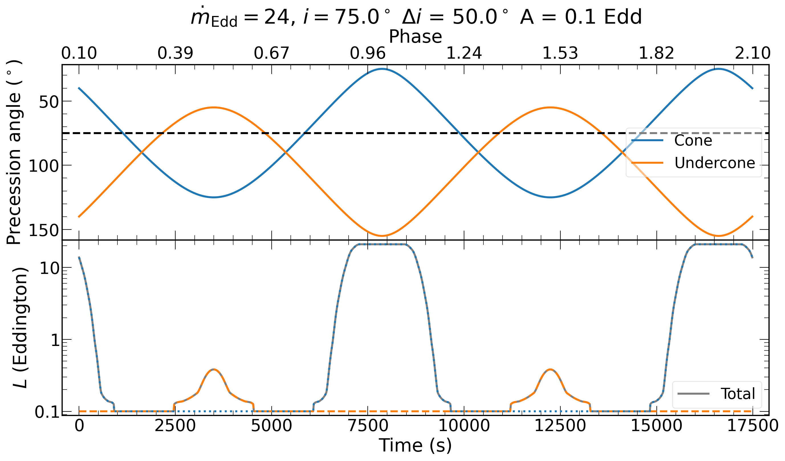

# QPEs
Fitting the lightcurves of quasi-periodic eruptions (QPEs) with a precession model and the output of GRMHD simulations 


The model is based on the kinematic model proposed to explain the periodic variations observed in the infamous high-mass X-ray binary SS433 ([Abel & Margon 1977](https://ui.adsabs.harvard.edu/abs/1979Natur.279..701A)):

$\cos \i (t) = \cos \Theta i \cos i_0 + \sin \Theta i \sin i_0 \cos \{2 \pi \[(t-t_\mathrm{0}) / P + \phi\]\}$

where $\i (t)$ is the instantaneous angle of the cone, $\phi = \omega t$ is the phase. For other definitions, here's a schematic of the model:


We couple that equation with the outputs from GRMHD simulations, which derived the Eddington luminosity (in the 0.3 $-$ 10 keV band) as a function of observer's inclination ($i$):


Only four values of $\dot{m}$ were calculated, as shown. Beyond $i\gtrsim67^\circ$ the simulations do not reach steady state, and we assumed the luminosity drops to 0 after that (but a constant component is added to the model to account for the quiescent emission / emission from higher inclinations which is assumed to plateau. We can then produce the following outputs:


 


(These Figures were created using ```plot_precessing_cone.py```)
# Usage
The script ```fit_lightcurve_harm_edd.py``` basically couples the model above and performs an MCMC on an input lightcurve.

**Important**: the lightcurve needs to be converted in Eddington units prior to fit it! If you know the count rates for some unabsorbed luminosities (e.g. derived from spectral fitting) you can simply map count rates to Eddington luminosities for your whole lightcurve using interpolation (see ```convert_lightcurve.py```)


Use the option -h to see all the available options for the scripts. 

# Acknowledgments
There will be a paper out... soon.
